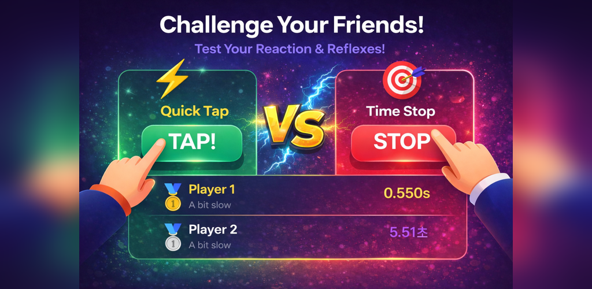
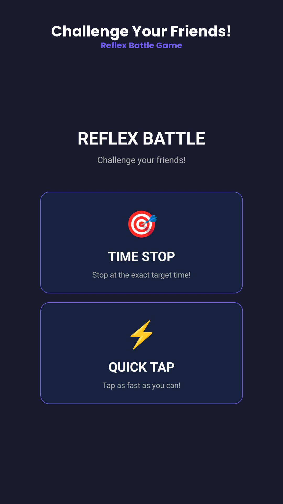
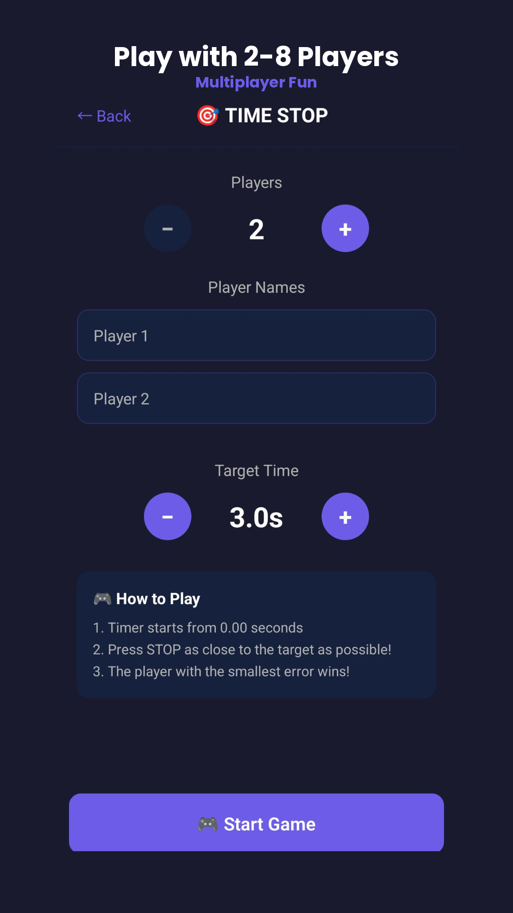
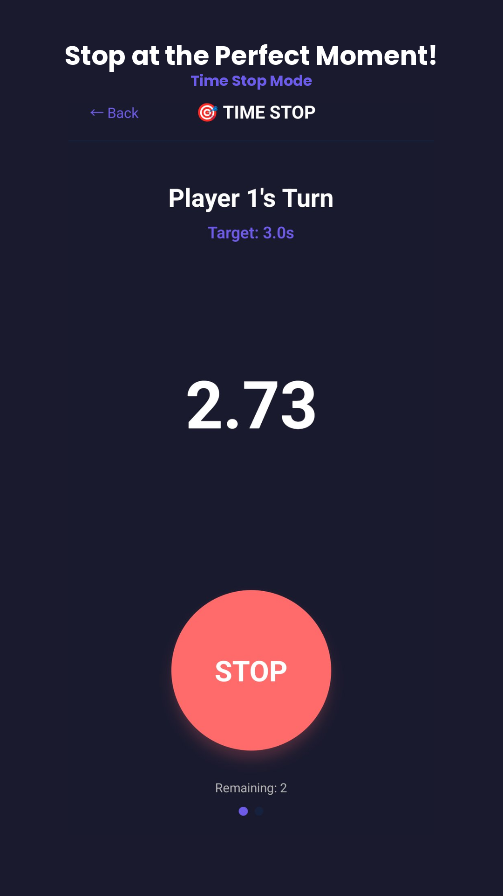
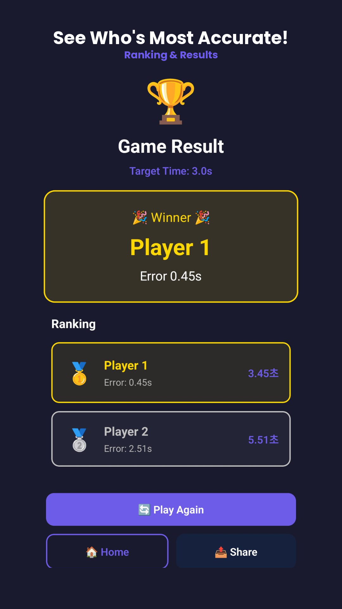
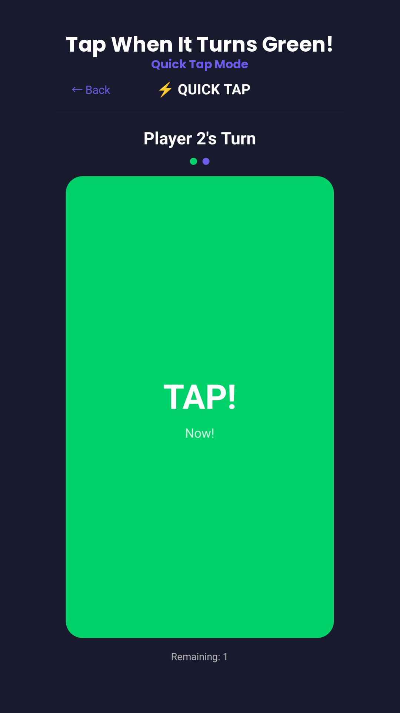
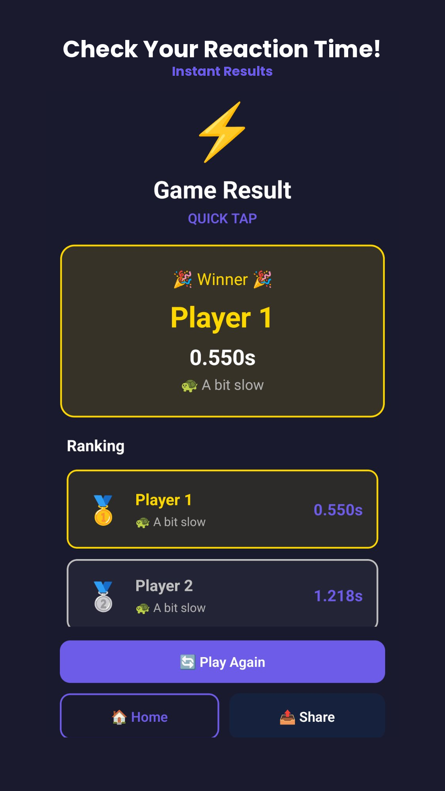

# Reflex Battle

A multiplayer reaction time game built with React Native and Expo. Challenge your friends and prove who has the fastest reflexes — all on one device!



## Screenshots

<div style="overflow-x: auto; white-space: nowrap;">
  
  
  
  
  
  
</div>

## Game Modes

### Time Stop

Set a target time and try to stop the timer as close to it as possible. The player with the best timing wins.

### Quick Tap

When the screen turns green, tap as fast as you can. But be careful — tap too early and you'll get a penalty!

## Features

- 2–8 players on a single device
- Two game modes with distinct challenges
- Dark theme UI with smooth animations
- Haptic feedback for immersive experience
- Offline play — no internet required
- Multilingual support (Korean, English, Japanese, Chinese, Russian)

## Tech Stack

| Category   | Technology                                  |
| ---------- | ------------------------------------------- |
| Framework  | React Native + Expo                         |
| Language   | TypeScript                                  |
| Navigation | Expo Router (file-based)                    |
| Ads        | Google AdMob (Banner, Interstitial, Native) |
| Animation  | React Native Reanimated                     |
| Haptics    | expo-haptics                                |
| i18n       | react-i18next                               |

## Project Structure

```
app/
  _layout.tsx          # Root layout (splash, ad init)
  index.tsx            # Home screen
  time-stop/
    setup.tsx          # Player setup
    game.tsx           # Time Stop game
    result.tsx         # Results & rankings
  quick-tap/
    setup.tsx          # Player setup
    game.tsx           # Quick Tap game
    result.tsx         # Results & rankings
components/            # Reusable UI components
hooks/                 # Custom hooks (timer, exit handler, etc.)
src/
  constants/           # Ad unit IDs, config
  contexts/            # Ad, Settings context providers
  i18n/                # Translations (ko, en, ja, zh, ru)
```

## Getting Started

### Prerequisites

- Node.js 18+
- Android Studio (for Android emulator) or Xcode (for iOS simulator)

### Installation

```bash
npm install
```

### Development

```bash
# Start Expo dev server
npx expo start

# Run on Android
npm run android

# Run on iOS
npm run ios
```

### Production Build

```bash
# Install EAS CLI
npm install -g eas-cli

# Build for Android (AAB for Play Store)
eas build --profile production --platform android

# Build for iOS
eas build --profile production --platform ios
```

## License

All rights reserved.
